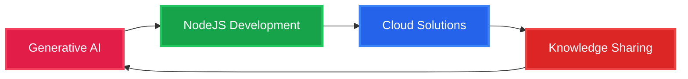

<div align="center">
  <h2>About Me</h2>
  </p>
    
    
    
  </p>
    <a href="https://app.daily.dev/betterdiff_"></a>
</div>

---

## What Drives Me

```python
class ShishirSrivastav:
    def __init__(self):
        self.role = "Full Stack Developer"
        self.experience = "3+ years"
        self.philosophy = "If it's structured, it Should be Clean"
        self.passion = ["Generative AI", "Clean Code", "Problem Solving", "Knowledge Sharing"]
        self.current_focus = "Growing Continously"
    
    def daily_routine(self):
        return [
            "Chai + Code",
            "Learn something new",
            "Build & Automate",
            "Share knowledge",
        ]
    
    def fun_fact(self):
        return "Only my code has logic, not my conversations 😄."
```

---

## Tech Arsenal

<div align="center">

### Languages & Frameworks


### Databases & Storage


### Tools & Technologies


</div>

---

## GitHub Analytics

<div align="center">
<a href="https://git.io/streak-stats"></a>
</div>

---

## Connect & Follow My Journey

<div align="center">
  
### Social Media
[](https://www.instagram.com/betterdiff_/)
[](https://discord.gg/snaps)

### Let's Collaborate
[](mailto:theogdiff@gmail.com)

</div>

---

## Current Focus



  ### Ready to build something amazing together?
  
  
  
  **Star my repositories if you find them helpful!**
  
</div>
